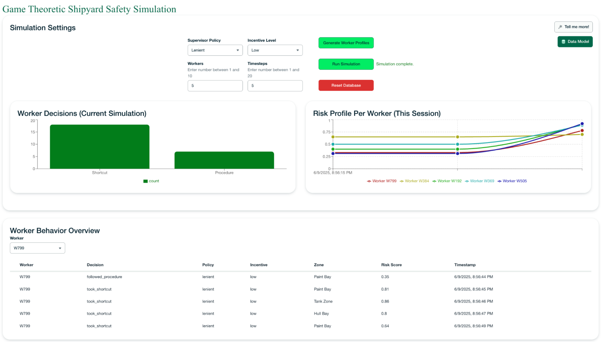

# Shipyard Safety Simulation Demo

## About this demo

This project is an interactive simulation and analytics dashboard that demonstrates how **game theory** can be applied to industrial safety scenarios, specifically in a shipyard environment. It uses **MongoDB** for flexible, real-time data storage, **FastAPI** for backend simulation logic, and a modern **React** (Next.js) frontend with LeafyGreen UI and Recharts for visualization.

**Key Features:**

- Simulate worker behavior under different supervisor policies and incentive levels.
- Generate synthetic worker profiles and environmental sensor data.
- Visualize worker decisions and risk profiles with interactive charts and tables.
- Inspect MongoDB data models directly from the UI.
- Reset and rerun simulations to explore different scenarios.

---

## Architecture

- **Frontend:** React (Next.js), LeafyGreen UI, Recharts
- **Backend:** FastAPI (Python)
- **Database:** MongoDB

---

## Getting Started

### Prerequisites

- Node.js (v18+ recommended)
- Python 3.8+
- MongoDB (local or Atlas)

### 1. Clone the Repository

```bash
git clone <your-repo-url>
cd shipyard_simulation_demo
```

### 2. Configure Environment Variables

Create a `.env` file in the `backend/` directory and set your MongoDB connection string:

```bash
echo "MONGO_URI=mongodb://localhost:27017/shipyard_demo" > backend/.env
```

> **Note:** Replace the connection string with your MongoDB Atlas URI if using a cloud database.

### 3. Choose Your Setup Method

You can set up the project using either Docker Compose (quick setup) or manual installation.

#### Option A: Quick Setup with Docker Compose

This is the fastest way to get everything running:

```bash
docker-compose up --build -d
```

That's it! The application will be available at [http://localhost:3008](http://localhost:3008).

#### Option B: Manual Setup

If you prefer to run components individually:

**Set Up the Backend:**

1. Navigate to the backend directory
2. Install dependencies:

   ```bash
   pip install -r requirements.txt
   ```

3. Start the FastAPI server (default port: `8008`):

   ```bash
   uvicorn main:app --reload --port 8008
   ```

**Set Up the Frontend:**

1. Navigate to the frontend directory:

   ```bash
   cd frontend
   ```

2. Install dependencies:

   ```bash
   npm install
   ```

3. Start the development server:

   ```bash
   npm run dev
   ```

4. Open [http://localhost:3008](http://localhost:3008) in your browser.

---

## Usage

1. **Configure Simulation:**  
   Select supervisor policy, incentive level, number of workers, and timesteps.

2. **Generate Workers:**  
   Click "Generate Worker Profiles" to create synthetic workers.

3. **Run Simulation:**  
   Click "Run Simulation" to simulate worker decisions and safety events.

4. **View Results:**

   - Worker behavior and sensor data are shown in tables.
   - Charts visualize worker decisions and risk profiles.
   - Click "Data Model" to inspect sample MongoDB documents.

5. **Reset Database:**  
   Click "Reset Database" to clear all data and start fresh.

---

## Screenshots



---

## Why MongoDB?

- **Flexible Data Model:** Store varied data (workers, behaviors, sensors) using the flexible document model.
- **Real-Time Analytics:** Aggregation pipelines and change streams enable real time analytics and responsive dashboards.
- **Scalability:** Easily handles large volumes of simulation and sensor data.

---

## Author

Humza Akhtar, MongoDB <humza.akhtar@mongodb.com>

---

## Technology Used

- [MongoDB](https://mongodb.com)
- [FastAPI](https://fastapi.tiangolo.com/)
- [LeafyGreen UI](https://www.mongodb.design/)
- [Recharts](https://recharts.org/)
